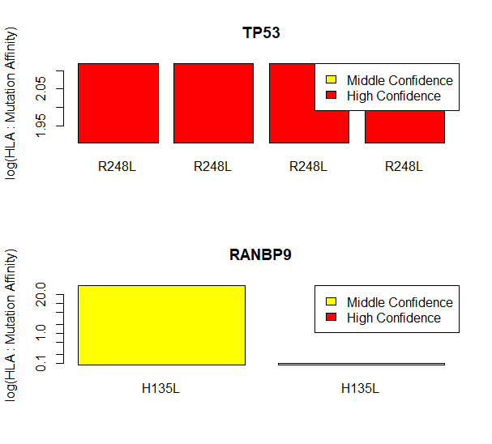

---
output:
  pdf_document: default
  html_document: default
---

<!-- README.md is generated from README.Rmd. Please edit that file -->

# lanpAnalysis

<!-- badges: start -->

<!-- badges: end -->

lanpAnalysis: (Lung Adenocarcinoma Neoantigen Patient Analysis) is an R package 
that aims to analyze patient peptide data, for probable HLA-I-binding neoantigens
that may be significant for lung adenocarcinoma immunotherapy. In recent years,
neoantigens have been be an immunotherapy target, as they may produce the 
rejection of tumours. lanpAnalysis streamlines this process by indexing and 
analyzing a patient's genes, and returns cruicial information on the presence
of these neoantigens, their relative affinities to HLA Alleles, and their 
location within the gene. 

## Changes Made Since Last Review:
* Checked concerns with not being able to graph with graph_affinity(). In a new pc I installed the package and was able to get a graph output with no issue. Try "graph_affinity("TP53", tp53mutated3times, 1)". A graph should be output on your plots, and NULL status should be returned (suggesting intended behaviour was observed.)
* Removed sysdata.rda from R subdirectory.
* Provided sessionInfo() at the end of vignette.
* Added CITATION for the package.
* Changed ls("package:") to properly display ls("package:lanpAnalysis")
* Added data(package = "lanpAnalysis") command.
* Checked to what extent I can change variable names to camelCaseStyle. Prior, I used camelCaseStyle and Snakecase. When I changed the variable names to camelCaseStyle, a crash was consistently induced in my package. I think this is due to a variable somewhere beyond the R subdirectory not being changed when prompted to. For the sake of preserving the functionality of the package, I kept both camelCaseStyle and Snakecase. Going forward though, I agree that I should solely use camelCaseStyle. In aspects of my code that were not already dependent on the R files using their old code (for example, shinyApp, I used the proper naming convention as much as I could.
* Completed documentation for functions as concerns were raised about this. Mainly I added function examples that were not present.
* Added shiny R package as import in DESCRIPTION.
* Add R function called runLanpAnalysis.R for running the shiny Applet.
* Documented runLanpAnalysis.R so the user may know what it does.

## Installation

You can install the released version of lanpAnalysis from
[GitHub](https://github.com/) with:

``` r
require("devtools")
devtools::install_github("lukatrkla/lanpAnalysis", build_vignettes = TRUE)
library("lanpAnalysis")
```
To run the Shiny app, if package is properly installed and shiny is (as well)
properly configured, use the following command:
``` r
runlanpAnalysis()
```
## Overview

``` r
ls("package:lanpAnalysis")
data(package = "lanpAnalysis")
```

The full information related to the functions in lanpAnalysis are provided in
the function's man pages, all of which are open when typing lanpAnalysis::...
The ultimate aim of the package is to provide a graphical output to the
patient's neoantigens that were discovered in their genes. 
There are 2 main outputs, one that appears as a graphical output noting the 
discovered neoantigens, their positions in the gene, and the binding affinity 
between the neoantigen and the HLA allele, which can be coloured according to the confidence level
between the mutation and the HLA allele. An example is directly below:


This is the code to make this graphical output, with all files included in the
package:

``` r
plot_mutation_location("TP53", tp53mutated3times, confidence = 1)
```
The other graphical output ranks the binding affinities of neoantigens, and produces
a barplot with this data. It can be coloured depending on confidence levels or
binding levels (You can read more about this in the below function's man page)
 An example is directly below:




This is the code to make this graphical output, with all files included in the
package:

``` r
lanpAnalysis::patient_affinity_visualizer(testingGeneSet, colNum=1, colorFlag=2)
```
## Contributions

This package was built with R base packages: graphics, and stats; it is suggested
that you download testthat as well. It uses stringr as well, which you can read 
on below in the references [3]. The database that was utilized for this package
'lungData' has been modified from database dbPepNeo [1]

# References

[1] 
Xiaoxiu Tan, Daixi Li, Pengjie Huang, Xingxing Jian, Huihui Wan, Guangzhi Wang, Yuyu Li, Jian
Ouyang, Yong Lin, Lu Xie, dbPepNeo: a manually curated database for human tumor neoantigen
peptides, Database, Volume 2020, 2020, baaa004, https://doi.org/10.1093/database/baaa004

[2] (Context information about Neoantigen was found here. I did not derive an idea from this
article, but I learned about neoantigens here, and if you need information, this is the place to start)
Evolution of Neoantigen Landscape during Immune Checkpoint Blockade in Non–Small Cell Lung
Cancer Valsamo Anagnostou, Kellie N. Smith, Patrick M. Forde, Noushin Niknafs, Rohit Bhattacharya,
James White, Theresa Zhang, Vilmos Adleff, Jillian Phallen, Neha Wali, Carolyn Hruban, Violeta B.
Guthrie, Kristen Rodgers, Jarushka Naidoo, Hyunseok Kang, William Sharfman, Christos Georgiades,
Franco Verde, Peter Illei, Qing Kay Li, Edward Gabrielson, Malcolm V. Brock, Cynthia A. Zahnow,
Stephen B. Baylin, Robert B. Scharpf, Julie R. Brahmer, Rachel Karchin, Drew M. Pardoll and Victor
E. Velculescu DOI: 10.1158/2159-8290.CD-16-0828 Published March 2017
[3] 
https://cran.r-project.org/web/packages/stringr/vignettes/stringr.html

# Acknowledgements

This package was developed as part of an assessment for 2020
BCB410H: Applied Bioinformatics, University of Toronto, Toronto,
CANADA.
